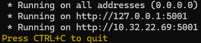
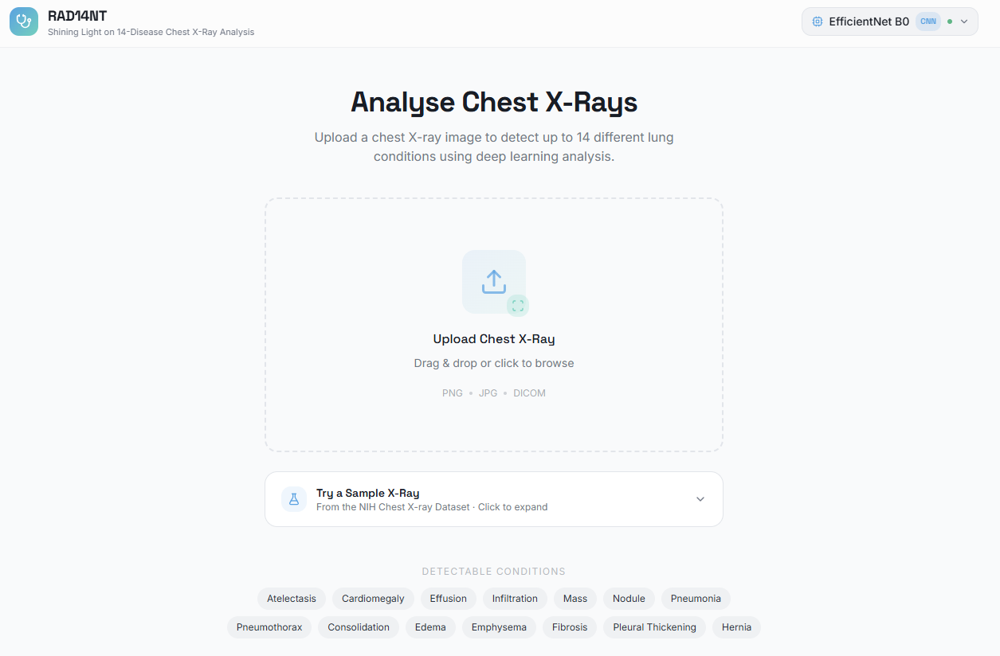

# Overview
This project compares Generic CV Models (ImageNet-based) and Domain-Specific Foundation Models (Medical-based) for automated multi-label classification of thoracic pathologies in chest X-ray imaging.

<!------------ NEXT SECTION ------------>

## Requirements:
- Python version of 3.11 and above is used for this project.
- CUDA is required for this project. Open a terminal from the root folder and run `python scripts/cuda_check.py`.
<!-- Alternative phrasing: -->
<!-- Run `cuda_check.py` under the `scripts` folder to ensure CUDA is available. -->
> Note: The python launcher utility differs from device to device. if `python` does not work, try using `py` or `py3`. Example: `py3 scripts/cuda_check.py`

<!------------ NEXT SECTION ------------>

## Downloading Dependencies:
Open a terminal from the root folder and run `python -m pip install -r requirements.txt`.
> Note: The python launcher utility differs from device to device. if `python` does not work, try using `py` or `py3`. Example: `py3 -m pip install -r requirements.txt`

<!------------ NEXT SECTION ------------>

## Dataset Setup:
This project uses the [NIH Chest X-rays dataset](https://www.kaggle.com/datasets/nih-chest-xrays/data).  
Due to size limitations, the dataset is not included in the repository.

### Step 1 — Generate Kaggle API token
1. Log in/Sign up to an account at [Kaggle](https://www.kaggle.com).
2. Click on your profile picture (top right) and select Settings.
3. Scroll down to the API section.
4. Click 'Create Legacy API Key'. This will download a file named `kaggle.json` to your computer.
5. Open your File Explorer and go to `C:\Users\<YourUsername>`.
6. Create a new folder named `.kaggle` (if it doesn't exist).
7. Move the `kaggle.json` file from your Downloads folder into the `.kaggle` folder.

### Step 2 — Download dataset
Open a terminal from the root folder and run `python scripts/download_dataset.py`.  
The dataset will be downloaded automatically.  
> Note: The python launcher utility differs from device to device. if `python` does not work, try using `py` or `py3`. Example: `py3 scripts/download_dataset.py`

<!------------ NEXT SECTION ------------>

## Downloading Model Weights:

### Step 1 — Download all 6 weight files
Click [here](https://huggingface.co/lyj9900/RAD14NT/tree/main/models) to download the `.pth` files that our team has trained using the NIH Chest X-rays dataset.

### Step 2 — Move the files to the correct location
1. Navigate to `React_WebApp > Local > backend`.
2. Create a folder called `checkpoints`.
3. Move all the downloaded weight files to this folder.

<!------------ NEXT SECTION ------------>

## Running the Web Application Locally

### Step 1 — Start the backend
1. Navigate to `React_WebApp > Local > backend`.
2. Open a terminal in this location and run `.\start_all.bat`.
> Note: It will take a while for the backend to start up, especially if it's your first time running it after booting up your device.
3. Wait for all 6 terminals automatically opened terminals to finish running the code. You should see the following:

> Sanity Check: Since there are 6 models to load, the each terminal should show one port for each loaded model (i.e. 5001, 5002, 5003, 5004, 5005, 5006). The example image shows 5001 which corresponds to ResNet50 loading successfully.  
<!-- Blockquote Separator -->
> Note: Every automatically opened terminal will have its corresponding model being shown in the window's title. If any terminal fails to load successfully, try re-downloading that specific weight file again.
4. Once all 6 terminals are up and running, the backend is ready.

### Step 2 — Start the frontend
1. Navigate to `React_WebApp > Local > frontend`.
2. Open a terminal in this location and run `npm i` to install all the required node modules.
3. Only after the backend is ready, run `npm run dev`.
4. `Ctrl + Click` the local host link that appeared to open the RAD14NT Web Application.
5. The homepage will look like this:

<!------------ NEXT SECTION ------------>

## Closing the Web Application

### Step 1 — Stopping the frontend
1. Go to the terminal where `npm run dev` was ran.
2. Keyboard Interrupt the frontend terminal using `Ctrl + C`.

### Step 2 — Stopping the backend
1. Go to the terminal where `.\start_all.bat` was ran.
2. Run `.\stop_all.bat`. Do **NOT** close all the 6 automatically terminals manually.
> Note: If you want to manually close the 6 terminals, make sure to Keyboard Interrupt (Ctrl + C) every terminal first.

<!------------ NEXT SECTION ------------>

